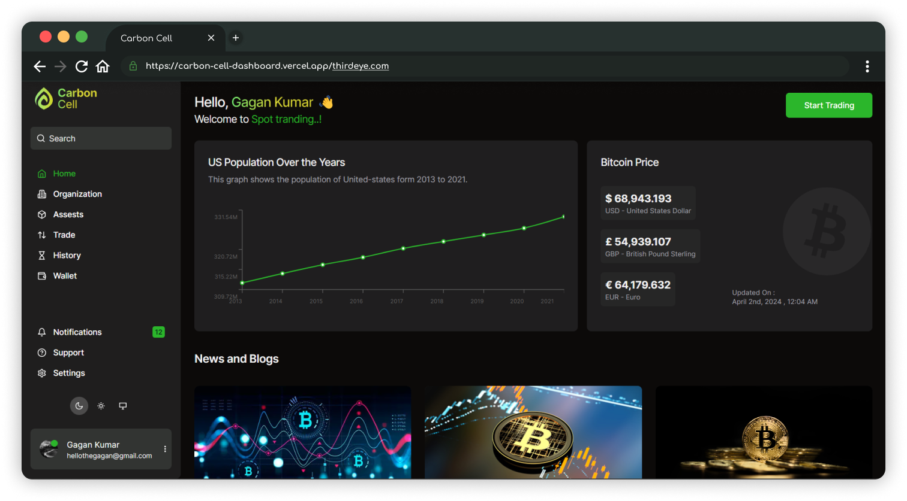

# Carbon Cell dashboard

<h5>
Discover the latest Bitcoin prices and trends. Stay informed with real-time updates on Bitcoin value in multiple currencies, including USD, GBP, and EUR
</h5>

 This project aims to create a simple and intuitive dashboard website. Users can view the Cryptocurrency Prices and US Popluation analysis. The website utilizes React JS (Next JS 14)for frontend development, and Tailwind CSS for styling.
</h4>
  

 

Live Site :  https://carbon-cell-dashboard.vercel.app/ 

## Key Features 🔥

1. ⚡**Next.js and Tailwind CSS Magic** : Application leverages Next.js for a powerful and efficient frontend. - Tailwind CSS brings flexibility and style,
   resulting in a sleek and modern design.
2. 📱 **Mobile Magic**: `Application is designed to shine on all devices, ensuring a seamless experience on mobile phones and tablets.
3. 🌓 **Adaptive Light and Dark Modes:**` Customize your view of your choice with light or dark mode. - Tailor your environment to suit your visual preferences.
4. 🪙 **Bitcoin price API:** - Bitcoin price api as been integrated, and value can be seen in multiple currency formats
5. 👯 **Popluation Data:** - US Popluation analytics as can been seen from 2013 to 2021.

# Technologies Used 🧑‍💻

`Next.js`: Framework for building the frontend.

`Tailwind CSS`: Utility-first CSS framework for styling.

`Vercel`: Hosting platform for deploying the application.

# Steps for setup and usage

## Installation 💻

-   Clone the Repository and Open your terminal.
-   Download all the file from the repo and keep it in a folder.
-   Run command `pnpm install` or `yarn install` or `npm install` (pnpm is prefered).
-   Running the above command will install all the required dependicies to run the application.
-   Start the development server by running `pnpm run dev` or `npm run dev`

At this point application is ready visit `http://localhost:3000/`

 

## API Interaction

-   Graph Population Data - `https://datausa.io/api/data?drilldowns=Nation&measures=Population`
-   Cryptocurrency Prices - `https://api.coindesk.com/v1/bpi/currentprice.json`

 

    <h3 align="center">💫 Developed with ❤️ by <a href="https://thegagan-portfolio.vercel.app/">Gagan Kumar</a> ╭❤️～ </h3>
    
 Don't be shy to contact 📫 <a href="mailto:example@gmail.com">hellothegagan@gmail.com</a>
 |
     🤙 +91-9036644552

